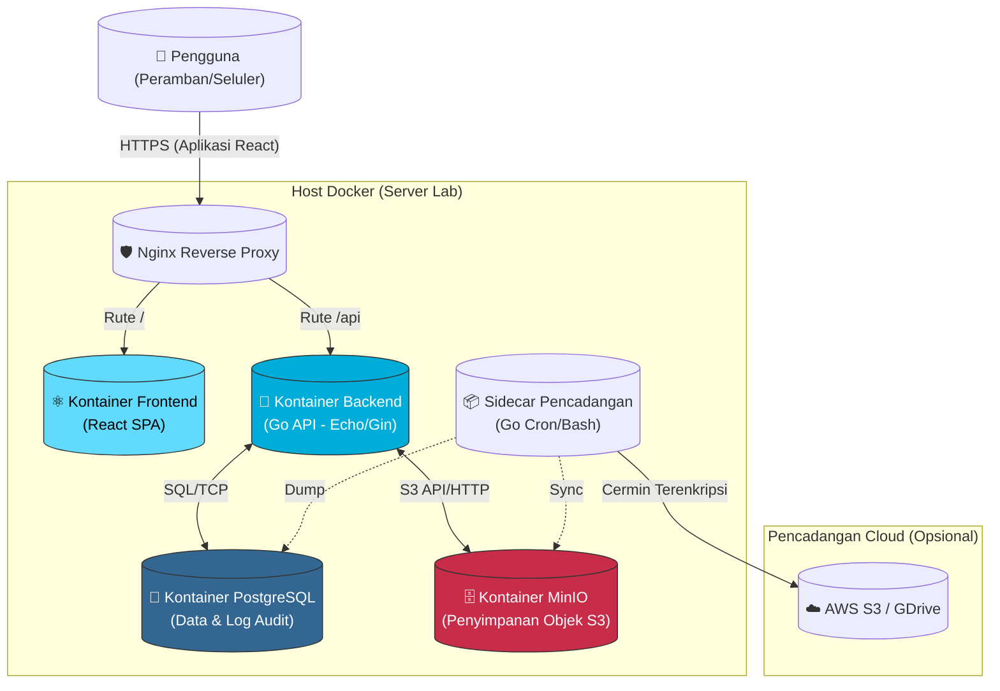

```mermaid
graph TD
    %% Lapisan Pengguna
    User[("👤 Pengguna (Peramban/Seluler)")] -->|"HTTPS (Aplikasi React)"| Nginx[("🛡️ Nginx Reverse Proxy")]
    
    %% Lapisan Server (Docker Host)
    subgraph "Host Docker (Server Lab)"
        Nginx
        
        %% Layanan Aplikasi
        Frontend[("⚛️ Kontainer Frontend<br/>(React SPA)")]
        Backend[("🐹 Kontainer Backend<br/>(Go API - Echo/Gin)")]
        
        Nginx -->|Rute /api| Backend
        Nginx -->|Rute /| Frontend
        
        %% Layanan Penyimpanan
        DB[("🐘 Kontainer PostgreSQL<br/>(Data & Log Audit)")]
        MinIO[("🗄️ Kontainer MinIO<br/>(Penyimpanan Objek S3)")]
        
        %% Komunikasi Antar-Kontainer
        Backend <-->|SQL/TCP| DB
        Backend <-->|S3 API/HTTP| MinIO
        
        %% Otomatisasi
        BackupService[("📦 Sidecar Pencadangan<br/>(Go Cron/Bash)")]
        BackupService -.->|Dump| DB
        BackupService -.->|Sync| MinIO
    end
    
    %% Lapisan Eksternal / Cloud
    subgraph "Pencadangan Cloud (Opsional)"
        CloudS3[("☁️ AWS S3 / GDrive")]
    end
    
    BackupService -->|Cermin Terenkripsi| CloudS3
    
    %% Gaya Visual
    classDef go fill:#00ADD8,stroke:#333,color:white;
    classDef react fill:#61DAFB,stroke:#333,color:black;
    classDef db fill:#336791,stroke:#333,color:white;
    classDef minio fill:#c72c48,stroke:#333,color:white;
    
    class Backend go
    class Frontend react
    class DB db
    class MinIO minio
```