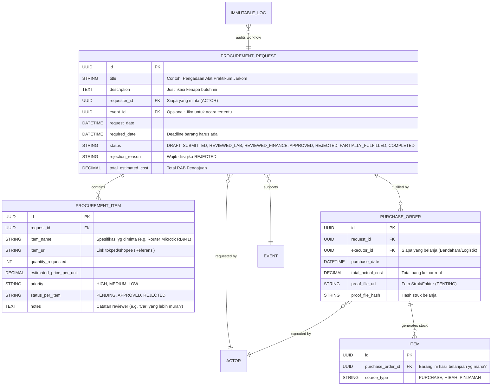

```mermaid
erDiagram
    %% --- HEADER PENGAJUAN ---
    PROCUREMENT_REQUEST {
        UUID id PK
        STRING title "Contoh: Pengadaan Alat Praktikum Jarkom"
        TEXT description "Justifikasi kenapa butuh ini"
        UUID requester_id FK "Siapa yang minta (ACTOR)"
        UUID event_id FK "Opsional: Jika untuk acara tertentu"
        DATETIME request_date
        DATETIME required_date "Deadline barang harus ada"
        STRING status "DRAFT, SUBMITTED, REVIEWED_LAB, REVIEWED_FINANCE, APPROVED, REJECTED, PARTIALLY_FULFILLED, COMPLETED"
        STRING rejection_reason "Wajib diisi jika REJECTED"
        DECIMAL total_estimated_cost "Total RAB Pengajuan"
    }

    %% --- DETAIL BARANG YG DIMINTA ---
    PROCUREMENT_ITEM {
        UUID id PK
        UUID request_id FK
        STRING item_name "Spesifikasi yg diminta (e.g. Router Mikrotik RB941)"
        STRING item_url "Link tokped/shopee (Referensi)"
        INT quantity_requested
        DECIMAL estimated_price_per_unit
        STRING priority "HIGH, MEDIUM, LOW"
        STRING status_per_item "PENDING, APPROVED, REJECTED"
        TEXT notes "Catatan reviewer (e.g. 'Cari yang lebih murah')"
    }

    %% --- EKSEKUSI PEMBELIAN (REALISASI) ---
    PURCHASE_ORDER {
        UUID id PK
        UUID request_id FK
        UUID executor_id FK "Siapa yang belanja (Bendahara/Logistik)"
        DATETIME purchase_date
        DECIMAL total_actual_cost "Total uang keluar real"
        STRING proof_file_url "Foto Struk/Faktur (PENTING)"
        STRING proof_file_hash "Hash struk belanja"
    }

    %% --- LINK KE INVENTARIS UTAMA (The Bridge) ---
    %% Ini tabel 'Inventory' yg kita buat sebelumnya (ITEM)
    %% Kita tambahkan FK ke sini biar tau asal-usul barang
    ITEM {
        UUID id PK
        UUID purchase_order_id FK "Barang ini hasil belanjaan yg mana?"
        STRING source_type "PURCHASE, HIBAH, PINJAMAN"
        %% ... kolom item lainnya ...
    }

    %% RELASI
    PROCUREMENT_REQUEST ||--o{ PROCUREMENT_ITEM : "contains"
    PROCUREMENT_REQUEST }o--|| ACTOR : "requested by"
    PROCUREMENT_REQUEST }o--|| EVENT : "supports"

    PROCUREMENT_REQUEST ||--o{ PURCHASE_ORDER : "fulfilled by"
    PURCHASE_ORDER }o--|| ACTOR : "executed by"
    
    %% Relasi Realisasi: 1 PO bisa menghasilkan banyak Item Inventaris
    PURCHASE_ORDER ||--o{ ITEM : "generates stock"

    %% LOGGING (Tetap wajib)
    IMMUTABLE_LOG }o--|| PROCUREMENT_REQUEST : "audits workflow"
```