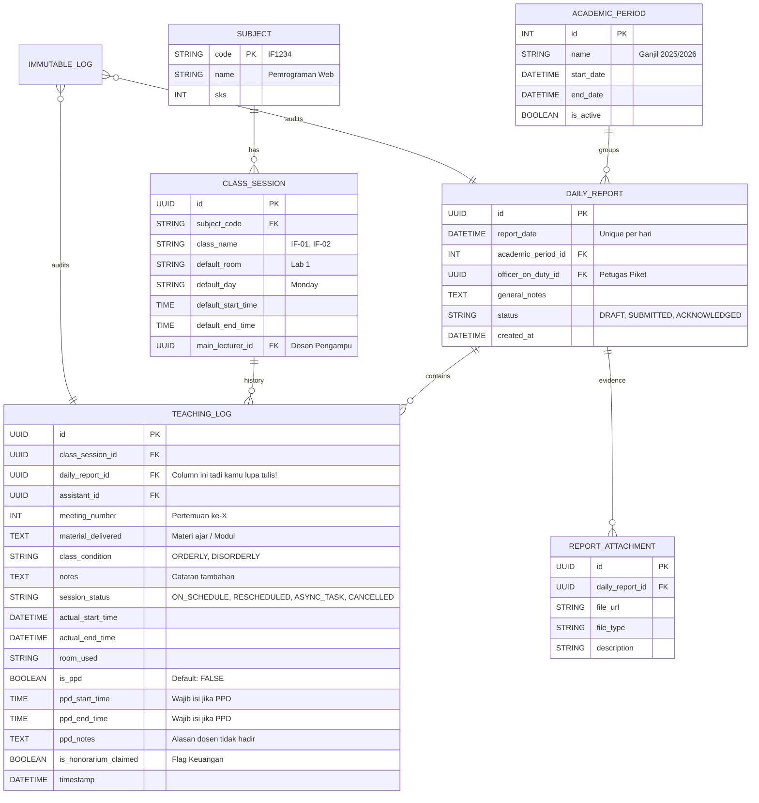

```mermaid
erDiagram
    %% --- 1. MASTER DATA ---
    ACADEMIC_PERIOD {
        INT id PK
        STRING name "Ganjil 2025/2026"
        DATETIME start_date
        DATETIME end_date
        BOOLEAN is_active
    }

    SUBJECT {
        STRING code PK "IF1234"
        STRING name "Pemrograman Web"
        INT sks
    }

    CLASS_SESSION {
        UUID id PK
        STRING subject_code FK
        STRING class_name "IF-01, IF-02"
        STRING default_room "Lab 1"
        STRING default_day "Monday"
        TIME default_start_time
        TIME default_end_time
        UUID main_lecturer_id FK "Dosen Pengampu"
    }

    %% --- 2. HEADER LAPORAN HARIAN ---
    DAILY_REPORT {
        UUID id PK
        DATETIME report_date "Unique per hari"
        INT academic_period_id FK
        UUID officer_on_duty_id FK "Petugas Piket"
        TEXT general_notes
        STRING status "DRAFT, SUBMITTED, ACKNOWLEDGED"
        DATETIME created_at
    }

    %% --- 3. BERITA ACARA (THE REAL DEAL) ---
    TEACHING_LOG {
        UUID id PK
        UUID class_session_id FK
        UUID daily_report_id FK "Column ini tadi kamu lupa tulis!"
        UUID assistant_id FK
        
        %% --- A. DATA PERTEMUAN (Yg tadi hilang) ---
        INT meeting_number "Pertemuan ke-X"
        TEXT material_delivered "Materi ajar / Modul"
        STRING class_condition "ORDERLY, DISORDERLY"
        TEXT notes "Catatan tambahan"

        %% --- B. LOGIKA STATUS & WAKTU ---
        STRING session_status "ON_SCHEDULE, RESCHEDULED, ASYNC_TASK, CANCELLED"
        DATETIME actual_start_time
        DATETIME actual_end_time
        STRING room_used
        
        %% --- C. LOGIKA PPD (Ganti Dosen) ---
        BOOLEAN is_ppd "Default: FALSE"
        TIME ppd_start_time "Wajib isi jika PPD"
        TIME ppd_end_time "Wajib isi jika PPD"
        TEXT ppd_notes "Alasan dosen tidak hadir"
        
        %% --- D. ADMIN ---
        BOOLEAN is_honorarium_claimed "Flag Keuangan"
        DATETIME timestamp
    }

    %% --- 4. BUKTI ---
    REPORT_ATTACHMENT {
        UUID id PK
        UUID daily_report_id FK
        STRING file_url
        STRING file_type
        STRING description
    }

    %% RELASI
    SUBJECT ||--o{ CLASS_SESSION : "has"
    ACADEMIC_PERIOD ||--o{ DAILY_REPORT : "groups"
    
    DAILY_REPORT ||--o{ TEACHING_LOG : "contains"
    DAILY_REPORT ||--o{ REPORT_ATTACHMENT : "evidence"
    
    CLASS_SESSION ||--o{ TEACHING_LOG : "history"
    
    IMMUTABLE_LOG }o--|| TEACHING_LOG : "audits"
    IMMUTABLE_LOG }o--|| DAILY_REPORT : "audits"
```