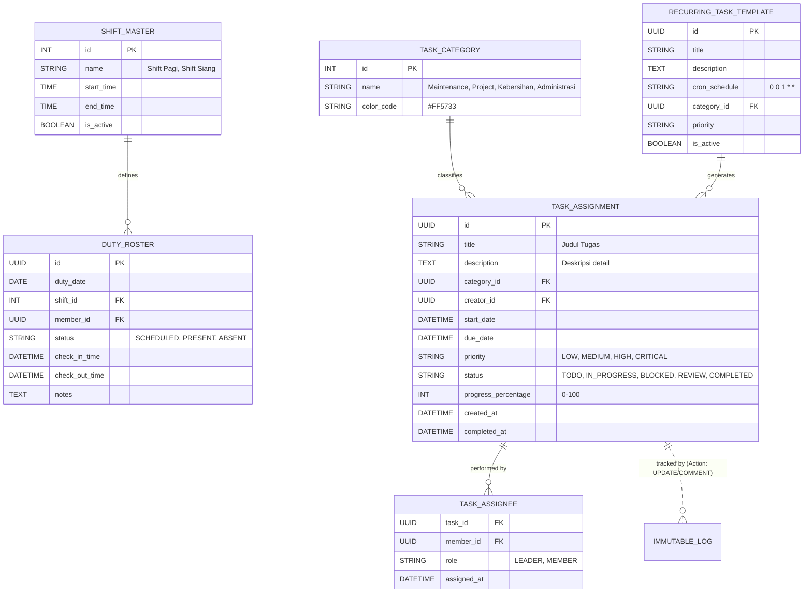

```mermaid
erDiagram
    %% ==========================================
    %% 1. JADWAL PIKET (DUTY ROSTER)
    %% ==========================================
    SHIFT_MASTER {
        INT id PK
        STRING name "Shift Pagi, Shift Siang"
        TIME start_time
        TIME end_time
        BOOLEAN is_active
    }

    DUTY_ROSTER {
        UUID id PK
        DATE duty_date
        INT shift_id FK
        UUID member_id FK
        STRING status "SCHEDULED, PRESENT, ABSENT"
        DATETIME check_in_time
        DATETIME check_out_time
        TEXT notes
    }

    %% ==========================================
    %% 2. KATEGORI & DEFINISI TUGAS
    %% ==========================================
    TASK_CATEGORY {
        INT id PK
        STRING name "Maintenance, Project, Kebersihan, Administrasi"
        STRING color_code "#FF5733"
    }

    TASK_ASSIGNMENT {
        UUID id PK
        STRING title "Judul Tugas"
        TEXT description "Deskripsi detail"
        UUID category_id FK
        UUID creator_id FK
        
        %% Manajemen Waktu & Prioritas
        DATETIME start_date
        DATETIME due_date
        STRING priority "LOW, MEDIUM, HIGH, CRITICAL"
        
        %% Status Workflow
        STRING status "TODO, IN_PROGRESS, BLOCKED, REVIEW, COMPLETED"
        INT progress_percentage "0-100"
        
        %% Metadata
        DATETIME created_at
        DATETIME completed_at
    }

    %% ==========================================
    %% 3. PELAKSANA TUGAS (ASSIGNEES)
    %% ==========================================
    TASK_ASSIGNEE {
        UUID task_id FK
        UUID member_id FK
        STRING role "LEADER, MEMBER"
        DATETIME assigned_at
    }

    %% ==========================================
    %% 4. AUTOMATION
    %% ==========================================
    RECURRING_TASK_TEMPLATE {
        UUID id PK
        STRING title
        TEXT description
        STRING cron_schedule "0 0 1 * *"
        UUID category_id FK
        STRING priority
        BOOLEAN is_active
    }

    %% ==========================================
    %% RELASI
    %% ==========================================
    
    %% Piket
    SHIFT_MASTER ||--o{ DUTY_ROSTER : "defines"
    
    %% Tugas
    TASK_CATEGORY ||--o{ TASK_ASSIGNMENT : "classifies"
    TASK_ASSIGNMENT ||--o{ TASK_ASSIGNEE : "performed by"
    
    %% Automation
    RECURRING_TASK_TEMPLATE ||--o{ TASK_ASSIGNMENT : "generates"

    %% Audit & History (Logika ke Central Log)
    TASK_ASSIGNMENT ||..o{ IMMUTABLE_LOG : "tracked by (Action: UPDATE/COMMENT)"
```