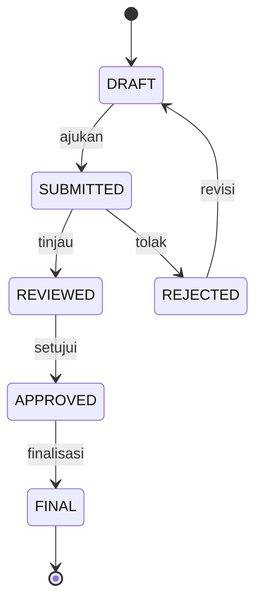

# CETAK BIRU (BLUEPRINT) ERP LAB SAQ

## 1. Visi Sistem

ERP LAB SAQ dirancang sebagai **sumber kebenaran tunggal (*single source of truth*)** untuk operasional laboratorium yang memenuhi standar **siap audit (*audit-ready*)**, **tahan manipulasi (*tamper-evident*)**, dan **dapat diskalakan (*scalable*)**. Sistem ini dibangun menggunakan teknologi modern (Go/React) untuk menjamin performa optimal serta kemudahan pemeliharaan jangka panjang.

---

## 2. Struktur Modul

```
ERP LAB SAQ
├── Dasbor (React)
├── Pengawasan (Ngawas)
│   ├── Laporan Harian
│   └── Berita Acara
├── Inventaris
│   ├── Data Barang
│   ├── Pencatatan Barang
│   └── Pengajuan Pengadaan
├── Acara (Berbasis Tag)
├── SDM / Keanggotaan
├── Penugasan & Jadwal Piket
├── Dokumen & Arsip (Didukung MinIO)
└── Keuangan (Akses Terbatas)
```

---

## 3. Sistem Inti

### 3.1 Kontrol Akses Berbasis Peran (RBAC) & Autentikasi
* Backend (Go) memvalidasi token JWT pada setiap permintaan (*request*).
* Peran (*Role*) disimpan dalam klaim token dan divalidasi ulang pada lapisan *Middleware*.

### 3.2 Mesin Alur Kerja (Workflow Engine)
Mesin status generik (*generic state machine*) diimplementasikan pada lapisan `Usecase` Go:



### 3.3 Log Audit Imutabel (Immutable Audit Log)
* **Aksi:** Setiap perubahan data (Create, Update, Delete) akan memicu penulisan log.
* **Konkurensi:** Menggunakan mekanisme `sync.Mutex` atau `Channel` pada Go untuk memastikan urutan rantai hash (`prev_hash` -> `curr_hash`) tetap terjaga saat terjadi banyak permintaan secara bersamaan.
* **Penyimpanan:** PostgreSQL JSONB digunakan untuk fleksibilitas skema perubahan (mengikuti standar RFC 6902).

### 3.4 Penyimpanan & Versioning
* **Berkas Biner:** Disimpan pada **MinIO** (*Self-hosted S3*).
* **Versioning:** Mengandalkan fitur **Object Versioning** dari S3/MinIO. Basis data hanya menyimpan `version_id` dari objek tersebut. Mekanisme ini menggantikan rencana awal penggunaan Git pada backend.

### 3.5 Pencadangan & Pemulihan
* **Basis Data:** `pg_dump` dijadwalkan melalui kontainer *sidecar*.
* **Berkas:** Pencerminan (*Mirroring*) MinIO atau pencadangan volume Docker secara berkala.

---

## 4. Model Data & Basis Data
* **PostgreSQL** digunakan sebagai penyimpanan data utama.
* Penerapan desain **Exclusive Arc** untuk polimorfisme relasi dokumen guna menjaga integritas referensial.
* Pemisahan tabel data sensitif (`MEMBER_SENSITIVE_DATA`) diterapkan secara ketat demi keamanan privasi.

---

## 5. Tahapan Implementasi

### Fase 1: Inti & Autentikasi
* Inisialisasi Proyek Go (Clean Architecture) & React.
* Implementasi Modul Anggota & Autentikasi (JWT).
* Konfigurasi Docker untuk MinIO & Postgres.

### Fase 2: Audit & Operasional Dasar
* Implementasi Layanan Log Imutabel.
* Modul Inventaris (CRUD Barang).
* Integrasi Unggah Berkas ke MinIO.

### Fase 3: Alur Kerja & Transaksi
* Logika Mesin Alur Kerja.
* Modul Pengajuan (Inventaris/Acara).
* Modul Keuangan.

### Fase 4: Pelaporan & Dasbor
* Visualisasi Dasbor Frontend.
* Ekspor Laporan (Pembuatan PDF pada Backend Go).