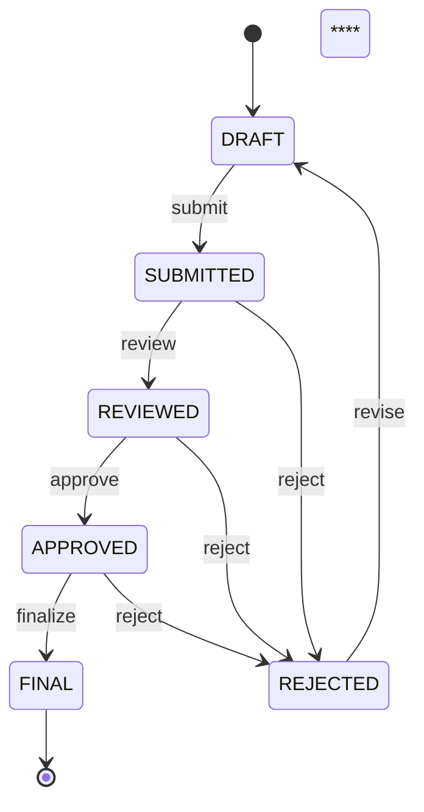

# BLUEPRINT ERP LAB SAQ

## 1. Visi Sistem

ERP LAB SAQ adalah **sistem kebenaran tunggal (single source of truth)** untuk:

* operasional lab
* administrasi & SDM
* aset & keuangan
* dokumentasi & audit

Dengan karakter:

* **audit-ready**
* **tamper-evident**
* **scalable**
* **role-aware**
* **workflow-driven**

---

## 2. Struktur Modul

```
ERP LAB SAQ
├── Dashboard
├── Ngawas
│   ├── Laporan Harian
│   └── Berita Acara
├── Inventaris
│   ├── Data Item
│   ├── Record Item
│   └── Pengajuan Item
├── Acara (Tag-based)
│   └── [Rapat | Webinar | Workshop | Quick Tutor | Pengmas | dll]
├── SDM / Anggota
├── Penugasan & Jadwal
├── Dokumen & Arsip
└── Keuangan (restricted)
```

Tag-based dipakai untuk:

* tipe acara
* role
* kategori dokumen
  → **expandable tanpa ubah skema**

---

## 3. Sistem Inti

### 3.1 RBAC

* Role **berbasis tag**
* Mendukung **scope** (lab/unit)
* Snapshot role disimpan di audit log

**Role inti:**

* anggota
* bendahara
* koor lab
* koor bendahara
  (+ role lain via tag)

**Separation of Duties (wajib):**

* mengajukan ≠ memfinalisasi

---

### 3.2 Workflow Engine

Generic state machine, dipakai lintas modul:



Dipakai untuk:

* pengajuan item
* perubahan data sensitif
* dokumen
* keuangan

---

### 3.3 Immutable Audit Log

**Karakter:**

* append-only
* tidak ada UPDATE / DELETE
* hanya via service layer

**Isi log (ringkas):**

* actor_id
* role_snapshot
* action
* object_type & object_id
* before_data / after_data
* timestamp
* prev_hash → current_hash

**Hash chaining:**

* setiap log tergantung log sebelumnya
* satu manipulasi → seluruh rantai rusak

**Strategi anti-tamper:**

* primary log
* secondary log (read-only / terpisah)
* snapshot berkala

➡ Sistem **tamper-evident** (target profesional, realistis)

---

### 3.4 Versioning

❌ **GitHub bukan pengganti ERP versioning**
✅ **Hybrid approach**

**GitHub:**

* menyimpan file
* diff & histori file

**ERP:**

* version number
* approval
* berlaku sejak kapan
* audit log
* konteks (lab, acara, kebijakan)

➡ ERP = **system of record**
➡ GitHub = **storage & tooling**

---

### 3.5 Soft Delete & Retention

* data tidak pernah benar-benar hilang
* `is_deleted`, `deleted_at`, `deleted_by`
* retention policy (configurable)

---

### 3.6 Encryption

* In-transit: HTTPS
* At-rest: database encryption
* Field-level: keuangan & identitas

---

### 3.7 Export / Import

**Export:**

* PDF
* CSV
* XLSX

**Import:**

* CSV / XLSX (controlled)

Tujuan:

* pelaporan ke atasan
* audit
* migrasi

---

### 3.8 Notification System

Event-based:

* pengajuan disetujui / ditolak
* laporan belum diisi
* jadwal berubah

Media:

* internal inbox
* email (opsional)

---

### 3.9 Integrity & Monitoring

* verifikasi hash log
* status backup
* deteksi missing log
* health check sistem

---

## 4. Database & Data Model

* Relational DB (PostgreSQL/MySQL)
* Audit log **terpisah secara logis**
* Workflow & RBAC **generik**
* Tag untuk fleksibilitas, bukan kolom enum keras

---

## 5. Security & Threat Model

Sistem **tidak mengklaim anti-hack**, tapi:

* setiap manipulasi **pasti terdeteksi**
* rollback, edit DB, hapus log → **ketahuan**
* audit forensik bisa dilakukan

➡ Ini **standar sistem institusi**, bukan startup main-main.

---

## 6. Tahapan Implementasi

### Fase 1

* User, Role, Permission
* Ngawas
* Inventaris
* Audit Log

### Fase 2

* Workflow engine
* Acara
* Penugasan

### Fase 3

* Dokumen + versioning
* Export
* Dashboard

### Fase 4

* Keuangan
* Integrity engine
* Monitoring