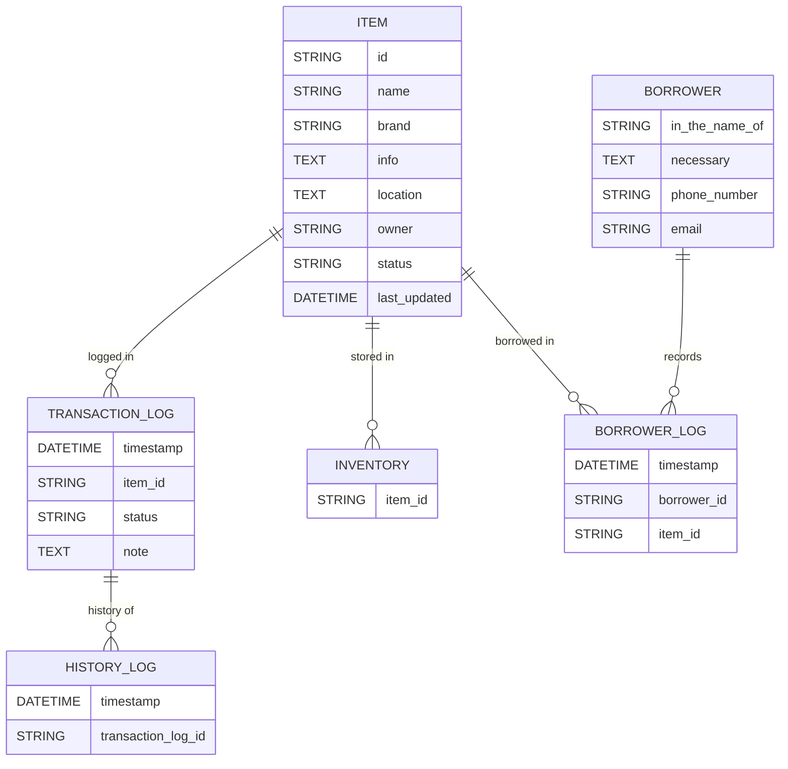

```mermaid
erDiagram
    BORROWER {
        STRING in_the_name_of
        TEXT necessary
        STRING phone_number
        STRING email
    }

    ITEM {
        STRING id
        STRING name
        STRING brand
        TEXT info
        TEXT location
        STRING owner
        STRING status
        DATETIME last_updated
    }

    TRANSACTION_LOG {
        DATETIME timestamp
        STRING item_id
        STRING status
        TEXT note
    }

    INVENTORY {
        STRING item_id
    }

    HISTORY_LOG {
        DATETIME timestamp
        STRING transaction_log_id
    }

    BORROWER_LOG {
        DATETIME timestamp
        STRING borrower_id
        STRING item_id
    }

    %% Relasi
    BORROWER ||--o{ BORROWER_LOG : "records"
    ITEM ||--o{ BORROWER_LOG : "borrowed in"
    ITEM ||--o{ INVENTORY : "stored in"
    ITEM ||--o{ TRANSACTION_LOG : "logged in"
    TRANSACTION_LOG ||--o{ HISTORY_LOG : "history of"
```