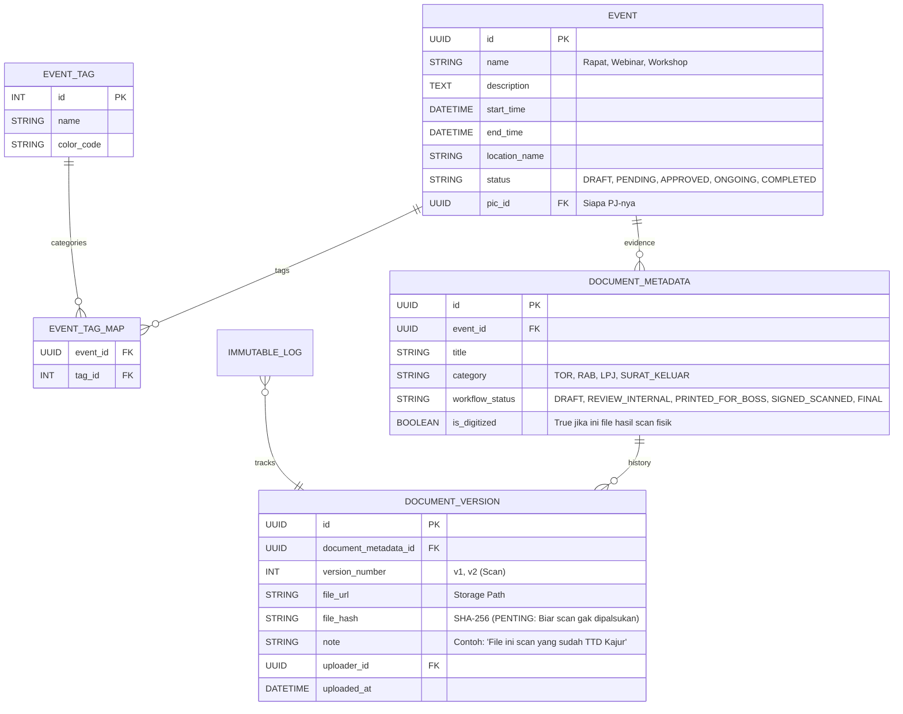

```mermaid
erDiagram
    %% --- INTI MODUL ACARA (Tetap) ---
    EVENT {
        UUID id PK
        STRING name "Rapat, Webinar, Workshop"
        TEXT description
        DATETIME start_time
        DATETIME end_time
        STRING location_name
        STRING status "DRAFT, PENDING, APPROVED, ONGOING, COMPLETED"
        UUID pic_id FK "Siapa PJ-nya"
    }

    EVENT_TAG {
        INT id PK
        STRING name
        STRING color_code
    }
    
    EVENT_TAG_MAP {
        UUID event_id FK
        INT tag_id FK
    }

    %% --- DOKUMEN (Fokus Softfile & Workflow Atasan) ---
    DOCUMENT_METADATA {
        UUID id PK
        UUID event_id FK
        STRING title
        STRING category "TOR, RAB, LPJ, SURAT_KELUAR"
        %% Status ini krusial untuk tracking fisik yang keluar
        STRING workflow_status "DRAFT, REVIEW_INTERNAL, PRINTED_FOR_BOSS, SIGNED_SCANNED, FINAL"
        BOOLEAN is_digitized "True jika ini file hasil scan fisik"
    }

    DOCUMENT_VERSION {
        UUID id PK
        UUID document_metadata_id FK
        INT version_number "v1, v2 (Scan)"
        STRING file_url "Storage Path"
        STRING file_hash "SHA-256 (PENTING: Biar scan gak dipalsukan)"
        STRING note "Contoh: 'File ini scan yang sudah TTD Kajur'"
        UUID uploader_id FK
        DATETIME uploaded_at
    }

    %% RELASI
    EVENT ||--o{ EVENT_TAG_MAP : "tags"
    EVENT_TAG ||--o{ EVENT_TAG_MAP : "categories"
    
    EVENT ||--o{ DOCUMENT_METADATA : "evidence"
    DOCUMENT_METADATA ||--o{ DOCUMENT_VERSION : "history"
    
    %% LOGGING (Wajib ada)
    IMMUTABLE_LOG }o--|| DOCUMENT_VERSION : "tracks"
```