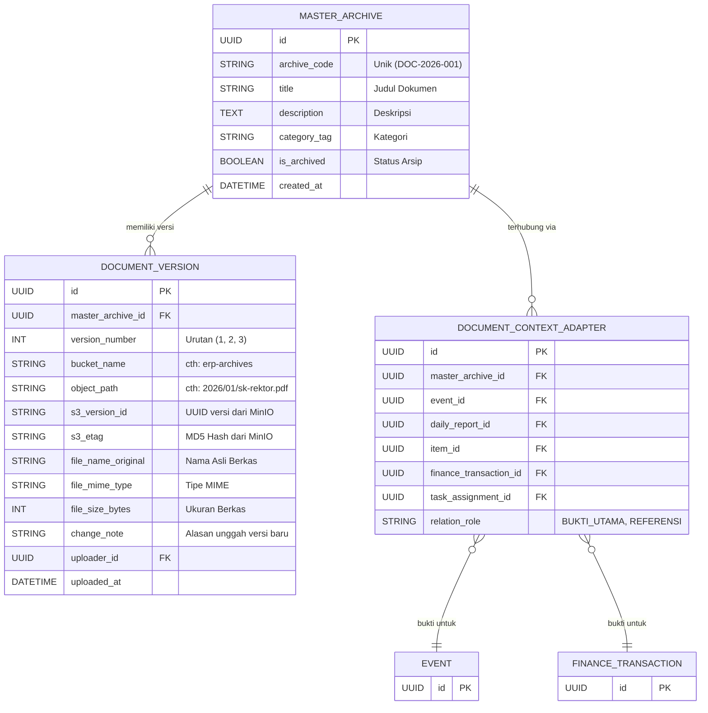

```mermaid
erDiagram
    %% ==========================================
    %% 1. ARSIP UTAMA (Hanya Metadata)
    %% ==========================================
    MASTER_ARCHIVE {
        UUID id PK
        STRING archive_code "Unik (DOC-2026-001)"
        STRING title "Judul Dokumen"
        TEXT description "Deskripsi"
        STRING category_tag "Kategori"
        BOOLEAN is_archived "Status Arsip"
        DATETIME created_at
    }

    %% ==========================================
    %% 2. KONTROL VERSI (MINIO BACKED)
    %% ==========================================
    %% Kolom referensi Git diganti dengan referensi S3/MinIO
    DOCUMENT_VERSION {
        UUID id PK
        UUID master_archive_id FK
        INT version_number "Urutan (1, 2, 3)"
        
        %% Referensi MinIO
        STRING bucket_name "cth: erp-archives"
        STRING object_path "cth: 2026/01/sk-rektor.pdf"
        STRING s3_version_id "UUID versi dari MinIO"
        STRING s3_etag "MD5 Hash dari MinIO"
        
        %% Metadata Berkas
        STRING file_name_original "Nama Asli Berkas"
        STRING file_mime_type "Tipe MIME"
        INT file_size_bytes "Ukuran Berkas"
        
        %% Konteks
        STRING change_note "Alasan unggah versi baru"
        UUID uploader_id FK
        DATETIME uploaded_at
    }

    %% ==========================================
    %% 3. ADAPTER (EXCLUSIVE ARC)
    %% ==========================================
    DOCUMENT_CONTEXT_ADAPTER {
        UUID id PK
        UUID master_archive_id FK
        
        %% Referensi Target (Boleh Null)
        UUID event_id FK
        UUID daily_report_id FK
        UUID item_id FK
        UUID finance_transaction_id FK
        UUID task_assignment_id FK
        
        STRING relation_role "BUKTI_UTAMA, REFERENSI"
    }
    
    %% ENTITAS LAIN
    EVENT { UUID id PK }
    FINANCE_TRANSACTION { UUID id PK }

    %% RELASI
    MASTER_ARCHIVE ||--o{ DOCUMENT_VERSION : "memiliki versi"
    MASTER_ARCHIVE ||--o{ DOCUMENT_CONTEXT_ADAPTER : "terhubung via"
    DOCUMENT_CONTEXT_ADAPTER }o--|| EVENT : "bukti untuk"
    DOCUMENT_CONTEXT_ADAPTER }o--|| FINANCE_TRANSACTION : "bukti untuk"
```