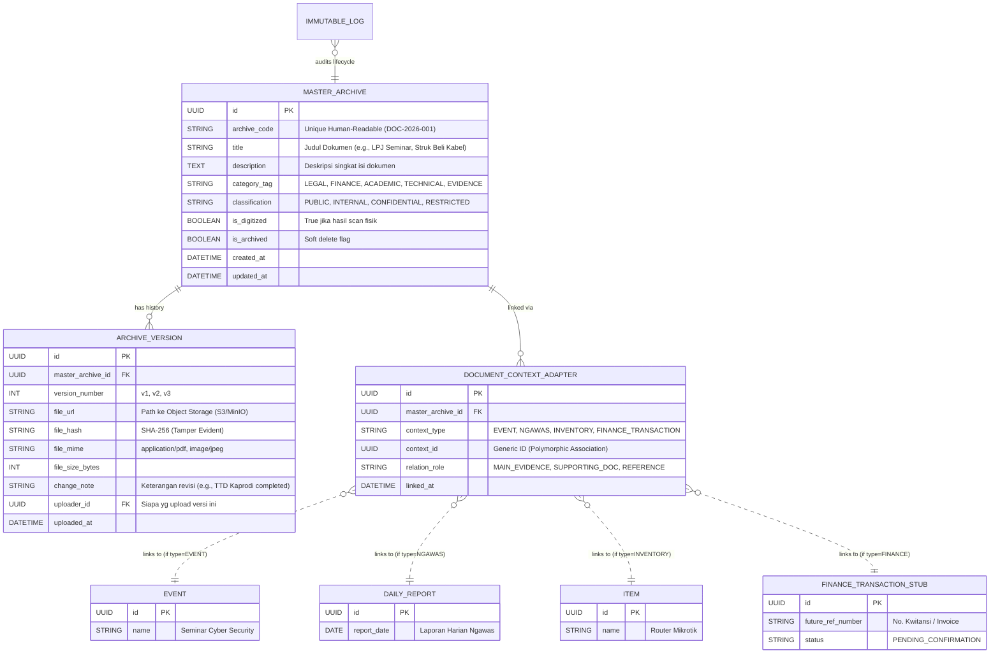

```mermaid
erDiagram
    %% ==========================================
    %% 1. GUDANG UTAMA (The Parent)
    %% ==========================================
    MASTER_ARCHIVE {
        UUID id PK
        STRING archive_code "Unique Human-Readable (DOC-2026-001)"
        STRING title "Judul Dokumen (e.g., LPJ Seminar, Struk Beli Kabel)"
        TEXT description "Deskripsi singkat isi dokumen"
        
        %% Kategori Global (Tag-based sesuai Blueprint)
        STRING category_tag "LEGAL, FINANCE, ACADEMIC, TECHNICAL, EVIDENCE"
        
        %% Akses & Keamanan
        STRING classification "PUBLIC, INTERNAL, CONFIDENTIAL, RESTRICTED"
        BOOLEAN is_digitized "True jika hasil scan fisik"
        BOOLEAN is_archived "Soft delete flag"
        
        DATETIME created_at
        DATETIME updated_at
    }

    %% ==========================================
    %% 2. VERSI FILE (Versioning System)
    %% ==========================================
    ARCHIVE_VERSION {
        UUID id PK
        UUID master_archive_id FK
        INT version_number "v1, v2, v3"
        
        %% Metadata File Fisik
        STRING file_url "Path ke Object Storage (S3/MinIO)"
        STRING file_hash "SHA-256 (Tamper Evident)"
        STRING file_mime "application/pdf, image/jpeg"
        INT file_size_bytes
        
        %% Context Revisi
        STRING change_note "Keterangan revisi (e.g., TTD Kaprodi completed)"
        UUID uploader_id FK "Siapa yg upload versi ini"
        DATETIME uploaded_at
    }

    %% ==========================================
    %% 3. THE ADAPTER (Jembatan ke Semua Modul)
    %% ==========================================
    %% Inilah "Parent" logic-nya. Satu dokumen bisa nyambung ke banyak modul.
    DOCUMENT_CONTEXT_ADAPTER {
        UUID id PK
        UUID master_archive_id FK
        
        %% CONTEXT TYPE: Menentukan tabel mana yg dituju
        STRING context_type "EVENT, NGAWAS, INVENTORY, FINANCE_TRANSACTION"
        
        %% CONTEXT ID: UUID dari record di tabel tujuan
        UUID context_id "Generic ID (Polymorphic Association)"
        
        %% Metadata Relasi
        STRING relation_role "MAIN_EVIDENCE, SUPPORTING_DOC, REFERENCE"
        DATETIME linked_at
    }

    %% ==========================================
    %% 4. MODUL-MODUL LAIN (Consumer)
    %% ==========================================
    %% Ini representasi modul yang sudah kita buat sebelumnya
    
    EVENT {
        UUID id PK
        STRING name "Seminar Cyber Security"
    }

    DAILY_REPORT {
        UUID id PK
        DATE report_date "Laporan Harian Ngawas"
    }
    
    ITEM {
        UUID id PK
        STRING name "Router Mikrotik"
    }

    %% ==========================================
    %% 5. FINANCE ADAPTER (Placeholder/Persiapan)
    %% ==========================================
    %% Ini tabel bayangan. Nanti kalau bendahara sudah confirm,
    %% kamu tinggal bikin tabel aslinya dan sambungkan ID-nya ke sini.
    FINANCE_TRANSACTION_STUB {
        UUID id PK
        STRING future_ref_number "No. Kwitansi / Invoice"
        STRING status "PENDING_CONFIRMATION"
    }

    %% ==========================================
    %% RELASI
    %% ==========================================
    
    %% Gudang punya banyak versi
    MASTER_ARCHIVE ||--o{ ARCHIVE_VERSION : "has history"
    
    %% Gudang bisa dipakai di banyak konteks
    MASTER_ARCHIVE ||--o{ DOCUMENT_CONTEXT_ADAPTER : "linked via"
    
    %% Polimorfisme (Visualisasi Logika Adapter)
    DOCUMENT_CONTEXT_ADAPTER }o..|| EVENT : "links to (if type=EVENT)"
    DOCUMENT_CONTEXT_ADAPTER }o..|| DAILY_REPORT : "links to (if type=NGAWAS)"
    DOCUMENT_CONTEXT_ADAPTER }o..|| ITEM : "links to (if type=INVENTORY)"
    DOCUMENT_CONTEXT_ADAPTER }o..|| FINANCE_TRANSACTION_STUB : "links to (if type=FINANCE)"

    %% Audit Log
    IMMUTABLE_LOG }o--|| MASTER_ARCHIVE : "audits lifecycle"
```