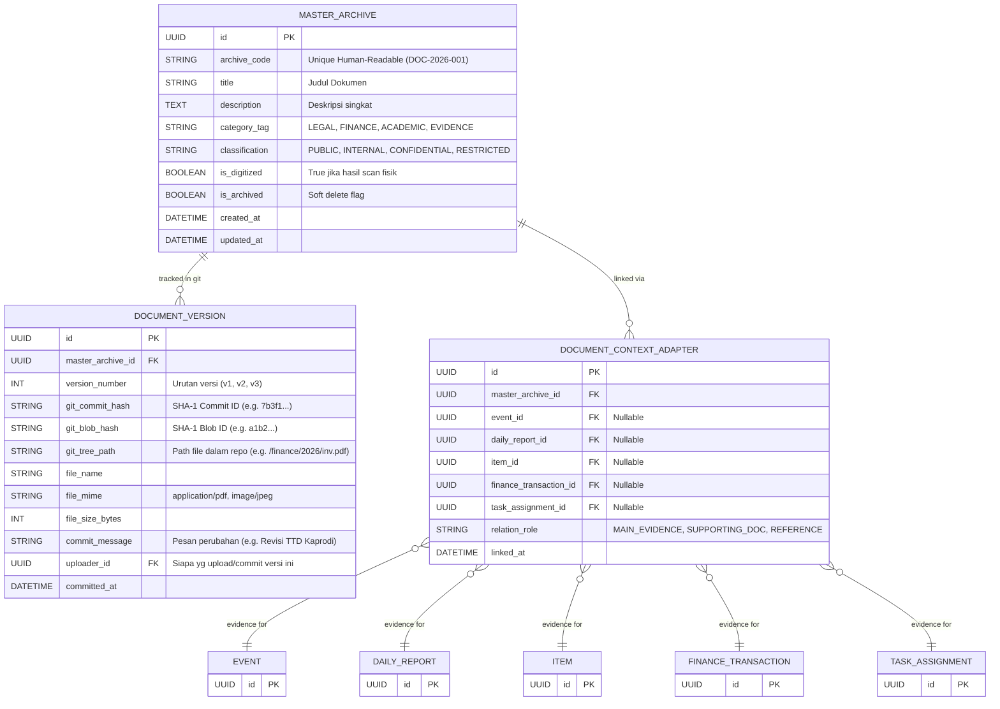

```mermaid
erDiagram
    %% ==========================================
    %% 1. GUDANG UTAMA (Metadata Only)
    %% ==========================================
    MASTER_ARCHIVE {
        UUID id PK
        STRING archive_code "Unique Human-Readable (DOC-2026-001)"
        STRING title "Judul Dokumen"
        TEXT description "Deskripsi singkat"
        
        %% Kategori & Akses
        STRING category_tag "LEGAL, FINANCE, ACADEMIC, EVIDENCE"
        STRING classification "PUBLIC, INTERNAL, CONFIDENTIAL, RESTRICTED"
        
        %% Status
        BOOLEAN is_digitized "True jika hasil scan fisik"
        BOOLEAN is_archived "Soft delete flag"
        
        DATETIME created_at
        DATETIME updated_at
    }

    %% ==========================================
    %% 2. VERSION CONTROL (GIT INTEGRATION)
    %% ==========================================
    %% File fisik dikelola oleh libgit2 di backend server.
    %% Database hanya mencatat pointer ke Commit Git.
    DOCUMENT_VERSION {
        UUID id PK
        UUID master_archive_id FK
        INT version_number "Urutan versi (v1, v2, v3)"
        
        %% Git References (The Real Storage)
        STRING git_commit_hash "SHA-1 Commit ID (e.g. 7b3f1...)"
        STRING git_blob_hash "SHA-1 Blob ID (e.g. a1b2...)"
        STRING git_tree_path "Path file dalam repo (e.g. /finance/2026/inv.pdf)"
        
        %% Metadata File
        STRING file_name
        STRING file_mime "application/pdf, image/jpeg"
        INT file_size_bytes
        
        %% Context Revisi
        STRING commit_message "Pesan perubahan (e.g. Revisi TTD Kaprodi)"
        UUID uploader_id FK "Siapa yg upload/commit versi ini"
        DATETIME committed_at
    }

    %% ==========================================
    %% 3. THE ADAPTER (EXCLUSIVE ARC PATTERN)
    %% ==========================================
    %% Jembatan polimorfik yang aman secara SQL.
    %% Constraint Logic:
    %% CHECK ( (event_id IS NOT NULL)::int + (item_id IS NOT NULL)::int + ... = 1 )
    DOCUMENT_CONTEXT_ADAPTER {
        UUID id PK
        UUID master_archive_id FK
        
        %% Target References (Nullable Foreign Keys)
        UUID event_id FK "Nullable"
        UUID daily_report_id FK "Nullable"
        UUID item_id FK "Nullable"
        UUID finance_transaction_id FK "Nullable"
        UUID task_assignment_id FK "Nullable"
        
        %% Metadata Relasi
        STRING relation_role "MAIN_EVIDENCE, SUPPORTING_DOC, REFERENCE"
        DATETIME linked_at
    }

    %% ==========================================
    %% 4. ENTITAS LUAR (Visualisasi Relasi)
    %% ==========================================
    EVENT { UUID id PK }
    DAILY_REPORT { UUID id PK }
    ITEM { UUID id PK }
    FINANCE_TRANSACTION { UUID id PK }
    TASK_ASSIGNMENT { UUID id PK }

    %% RELASI
    MASTER_ARCHIVE ||--o{ DOCUMENT_VERSION : "tracked in git"
    MASTER_ARCHIVE ||--o{ DOCUMENT_CONTEXT_ADAPTER : "linked via"
    
    %% Exclusive Arc Relations (Satu Adapter hanya ke Satu Target)
    DOCUMENT_CONTEXT_ADAPTER }o--|| EVENT : "evidence for"
    DOCUMENT_CONTEXT_ADAPTER }o--|| DAILY_REPORT : "evidence for"
    DOCUMENT_CONTEXT_ADAPTER }o--|| ITEM : "evidence for"
    DOCUMENT_CONTEXT_ADAPTER }o--|| FINANCE_TRANSACTION : "evidence for"
    DOCUMENT_CONTEXT_ADAPTER }o--|| TASK_ASSIGNMENT : "evidence for"
```