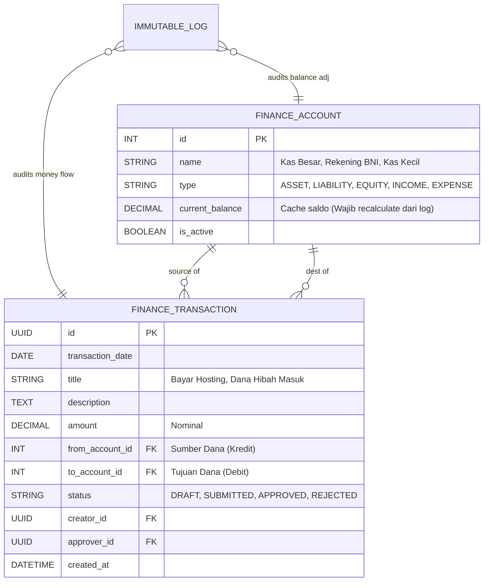

```mermaid
erDiagram
    %% --- 1. DOMPET / AKUN (Chart of Accounts Sederhana) ---
    FINANCE_ACCOUNT {
        INT id PK
        STRING name "Kas Besar, Rekening BNI, Kas Kecil"
        STRING type "ASSET, LIABILITY, EQUITY, INCOME, EXPENSE"
        DECIMAL current_balance "Cache saldo (Wajib recalculate dari log)"
        BOOLEAN is_active
    }

    %% --- 2. TRANSAKSI (Jantungnya) ---
    FINANCE_TRANSACTION {
        UUID id PK
        DATE transaction_date
        STRING title "Bayar Hosting, Dana Hibah Masuk"
        TEXT description
        DECIMAL amount "Nominal"
        
        %% Flow Uang
        INT from_account_id FK "Sumber Dana (Kredit)"
        INT to_account_id FK "Tujuan Dana (Debit)"
        
        %% Status Approval (Workflow berlaku disini!)
        STRING status "DRAFT, SUBMITTED, APPROVED, REJECTED"
        UUID creator_id FK
        UUID approver_id FK
        
        DATETIME created_at
    }

    %% --- 3. RELASI KE ARSIP (The Bridge) ---
    %% Ingat tabel DOCUMENT_CONTEXT_ADAPTER di file dokumen_dan_arsip.md?
    %% Kita tidak bikin tabel baru untuk bukti, tapi pakai Adapter itu.
    %% Logic di Code: 
    %% INSERT INTO DOCUMENT_CONTEXT_ADAPTER (context_type, context_id) 
    %% VALUES ('FINANCE_TRANSACTION', transaction.id)

    %% --- 4. AUDIT (Wajib) ---
    IMMUTABLE_LOG }o--|| FINANCE_TRANSACTION : "audits money flow"
    IMMUTABLE_LOG }o--|| FINANCE_ACCOUNT : "audits balance adj"

    %% Relasi
    FINANCE_ACCOUNT ||--o{ FINANCE_TRANSACTION : "source of"
    FINANCE_ACCOUNT ||--o{ FINANCE_TRANSACTION : "dest of"
```