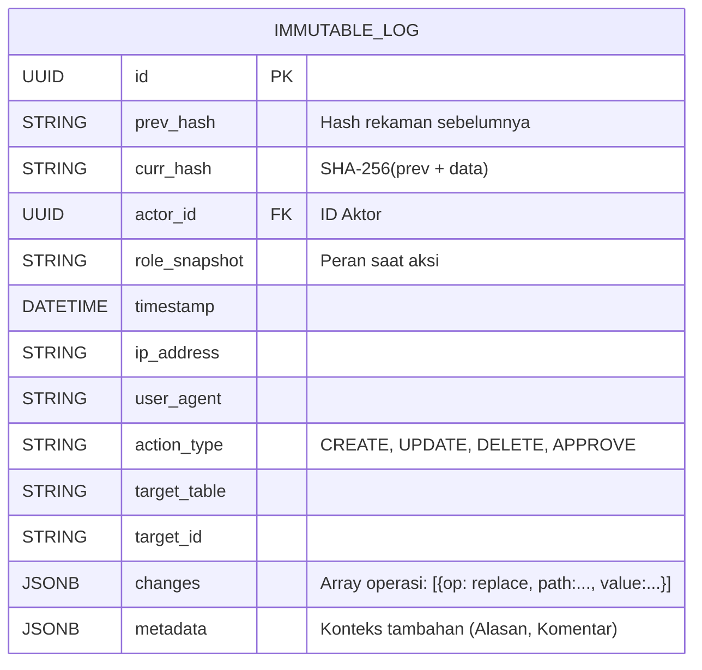

```mermaid
erDiagram
    %% ==========================================
    %% LOG AUDIT TERPUSAT
    %% ==========================================
    IMMUTABLE_LOG {
        UUID id PK
        
        %% --- RANTAI KEAMANAN ---
        STRING prev_hash "Hash rekaman sebelumnya"
        STRING curr_hash "SHA-256(prev + data)"
        
        %% --- SIAPA & KAPAN ---
        UUID actor_id FK "ID Aktor"
        STRING role_snapshot "Peran saat aksi"
        DATETIME timestamp
        STRING ip_address
        STRING user_agent
        
        %% --- APA (TARGET) ---
        STRING action_type "CREATE, UPDATE, DELETE, APPROVE"
        STRING target_table
        STRING target_id
        
        %% --- DATA (RFC 6902 JSON PATCH) ---
        %% Pada Go, diproses menggunakan 'encoding/json'
        JSONB changes "Array operasi: [{op: replace, path:..., value:...}]"
        
        %% --- METADATA ---
        JSONB metadata "Konteks tambahan (Alasan, Komentar)"
    }
```