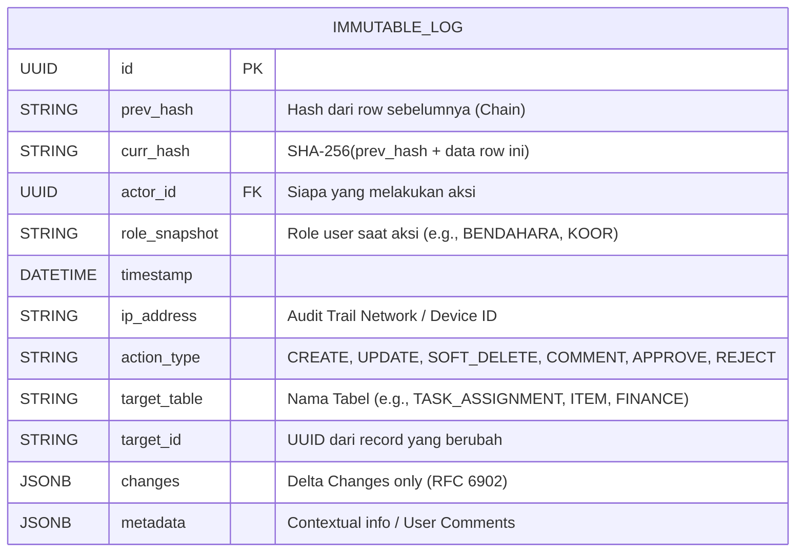

```mermaid
erDiagram
    %% ==========================================
    %% CENTRALIZED AUDIT LOG
    %% ==========================================
    IMMUTABLE_LOG {
        UUID id PK
        
        %% --- SECURITY: TAMPER EVIDENT ---
        %% Hash dari row sebelumnya. Jika null, berarti genesis block.
        STRING prev_hash "Hash dari row sebelumnya (Chain)"
        
        %% SHA-256(prev_hash + actor_id + timestamp + action + changes)
        STRING curr_hash "SHA-256(prev_hash + data row ini)"
        
        %% --- WHO & WHEN ---
        UUID actor_id FK "Siapa yang melakukan aksi"
        STRING role_snapshot "Role user saat aksi (e.g., BENDAHARA, KOOR)"
        DATETIME timestamp
        STRING ip_address "Audit Trail Network / Device ID"
        
        %% --- WHAT (TARGET) ---
        STRING action_type "CREATE, UPDATE, SOFT_DELETE, COMMENT, APPROVE, REJECT"
        STRING target_table "Nama Tabel (e.g., TASK_ASSIGNMENT, ITEM, FINANCE)"
        STRING target_id "UUID dari record yang berubah"
        
        %% --- THE DATA (OPTIMIZED) ---
        %% Ganti 'before/after' snapshot dengan RFC 6902 JSON Patch
        %% Contoh: [{"op": "replace", "path": "/status", "value": "COMPLETED"}]
        JSONB changes "Delta Changes only (RFC 6902)"
        
        %% --- METADATA (CONTEXT) ---
        %% Untuk menyimpan hal-hal yang bukan perubahan data tabel,
        %% seperti isi komentar user, alasan reject, atau user agent browser.
        %% Contoh: {"comment": "Revisi karena salah harga", "browser": "Chrome 120"}
        JSONB metadata "Contextual info / User Comments"
    }

    %% Referensi Logika (Tidak ada FK fisik ke semua tabel karena generic)
    %% IMMUTABLE_LOG }o..|| ANY_TABLE : "tracks"
```