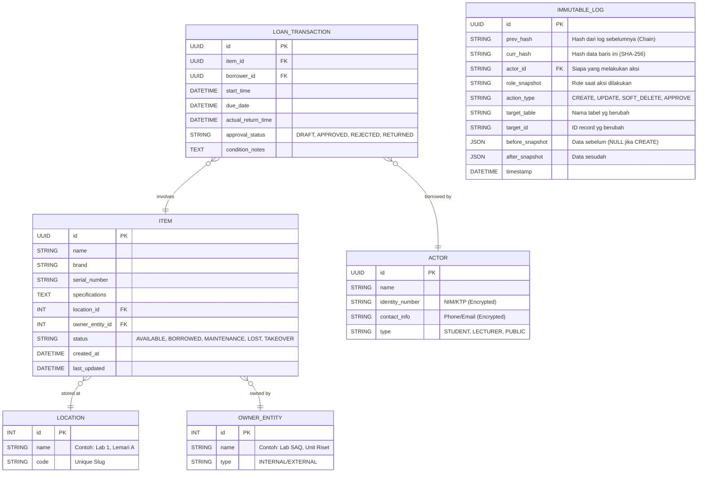

```mermaid
erDiagram
    %% CORE REFERENCE TABLES (Normalization)
    LOCATION {
        INT id PK
        STRING name "Contoh: Lab 1, Lemari A"
        STRING code "Unique Slug"
    }

    OWNER_ENTITY {
        INT id PK
        STRING name "Contoh: Lab SAQ, Unit Riset"
        STRING type "INTERNAL/EXTERNAL"
    }

    %% MAIN ASSET TABLE
    ITEM {
        UUID id PK
        STRING name
        STRING brand
        STRING serial_number
        TEXT specifications
        INT location_id FK
        INT owner_entity_id FK
        STRING status "AVAILABLE, BORROWED, MAINTENANCE, LOST, TAKEOVER"
        DATETIME created_at
        DATETIME last_updated
    }

    %% ACTOR / EXTERNAL BORROWER
    ACTOR {
        UUID id PK
        STRING name
        STRING identity_number "NIM/KTP (Encrypted)"
        STRING contact_info "Phone/Email (Encrypted)"
        STRING type "STUDENT, LECTURER, PUBLIC"
    }

    %% BUSINESS PROCESS: PEMINJAMAN
    LOAN_TRANSACTION {
        UUID id PK
        UUID item_id FK
        UUID borrower_id FK
        DATETIME start_time
        DATETIME due_date
        DATETIME actual_return_time
        STRING approval_status "DRAFT, APPROVED, REJECTED, RETURNED"
        TEXT condition_notes
    }

    %% THE HEART: IMMUTABLE AUDIT LOG (Blueprint Compliant)
    IMMUTABLE_LOG {
        UUID id PK
        STRING prev_hash "Hash dari log sebelumnya (Chain)"
        STRING curr_hash "Hash data baris ini (SHA-256)"
        STRING actor_id FK "Siapa yang melakukan aksi"
        STRING role_snapshot "Role saat aksi dilakukan"
        STRING action_type "CREATE, UPDATE, SOFT_DELETE, APPROVE"
        STRING target_table "Nama tabel yg berubah"
        STRING target_id "ID record yg berubah"
        JSON before_snapshot "Data sebelum (NULL jika CREATE)"
        JSON after_snapshot "Data sesudah"
        DATETIME timestamp
    }

    %% RELATIONS
    ITEM }o--|| LOCATION : "stored at"
    ITEM }o--|| OWNER_ENTITY : "owned by"
    LOAN_TRANSACTION }o--|| ITEM : "involves"
    LOAN_TRANSACTION }o--|| ACTOR : "borrowed by"
    
    %% Note: IMMUTABLE_LOG mencatat perubahan di semua tabel di atas
```