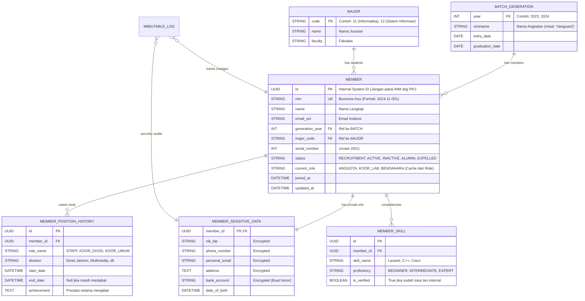

```mermaid
erDiagram
    %% --- 1. REFERENSI (Master Data) ---
    MAJOR {
        STRING code PK "Contoh: 11 (Informatika), 12 (Sistem Informasi)"
        STRING name "Nama Jurusan"
        STRING faculty "Fakultas"
    }

    BATCH_GENERATION {
        INT year PK "Contoh: 2023, 2024"
        STRING nickname "Nama Angkatan (misal: 'Vanguard')"
        DATE entry_date
        DATE graduation_date
    }

    %% --- 2. CORE IDENTITY (Public Info) ---
    MEMBER {
        UUID id PK "Internal System ID (Jangan pakai NIM sbg PK!)"
        STRING nim UK "Business Key (Format: 2024-11-001)"
        STRING name "Nama Lengkap"
        STRING email_uni "Email Institusi"
        
        %% Komponen NIM (Diekstrak biar gampang filter)
        INT generation_year FK "Ref ke BATCH"
        STRING major_code FK "Ref ke MAJOR"
        INT serial_number "Urutan (001)"
        
        %% Status Keanggotaan
        STRING status "RECRUITMENT, ACTIVE, INACTIVE, ALUMNI, EXPELLED"
        STRING current_role "ANGGOTA, KOOR_LAB, BENDAHARA (Cache dari Role)"
        
        DATETIME joined_at
        DATETIME updated_at
    }

    %% --- 3. SENSITIVE DATA (PII - Wajib Encrypted) ---
    %% Dipisah biar kalau tabel MEMBER di-select sembarangan, data ini gak ikut ke-expose
    MEMBER_SENSITIVE_DATA {
        UUID member_id PK, FK
        STRING nik_ktp "Encrypted"
        STRING phone_number "Encrypted"
        STRING personal_email "Encrypted"
        TEXT address "Encrypted"
        STRING bank_account "Encrypted (Buat honor)"
        DATETIME date_of_birth
    }

    %% --- 4. CAREER PATH (History Jabatan) ---
    MEMBER_POSITION_HISTORY {
        UUID id PK
        UUID member_id FK
        STRING role_name "STAFF, KOOR_DIVISI, KOOR_UMUM"
        STRING division "Divisi Jarkom, Multimedia, dll"
        DATETIME start_date
        DATETIME end_date "Null jika masih menjabat"
        TEXT achievement "Prestasi selama menjabat"
    }

    %% --- 5. SKILLSET (Buat Penugasan Proyek) ---
    MEMBER_SKILL {
        UUID id PK
        UUID member_id FK
        STRING skill_name "Laravel, C++, Cisco"
        STRING proficiency "BEGINNER, INTERMEDIATE, EXPERT"
        BOOLEAN is_verified "True jika sudah lulus tes internal"
    }

    %% RELASI
    BATCH_GENERATION ||--o{ MEMBER : "has members"
    MAJOR ||--o{ MEMBER : "has students"
    
    MEMBER ||--|| MEMBER_SENSITIVE_DATA : "has private info"
    MEMBER ||--o{ MEMBER_POSITION_HISTORY : "career track"
    MEMBER ||--o{ MEMBER_SKILL : "competencies"
    
    %% AUDIT
    IMMUTABLE_LOG }o--|| MEMBER : "tracks changes"
    IMMUTABLE_LOG }o--|| MEMBER_SENSITIVE_DATA : "securely audits"
```