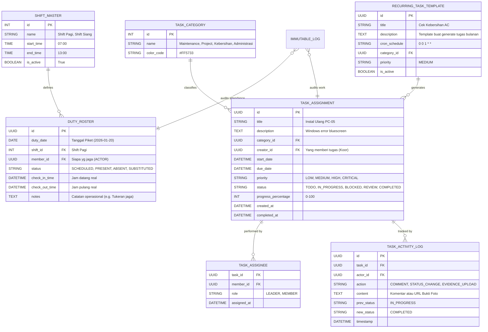

```mermaid
erDiagram
    %% ==========================================
    %% 1. JADWAL PIKET (DUTY ROSTER)
    %% ==========================================
    SHIFT_MASTER {
        INT id PK
        STRING name "Shift Pagi, Shift Siang"
        TIME start_time "07:00"
        TIME end_time "13:00"
        BOOLEAN is_active "True"
    }

    DUTY_ROSTER {
        UUID id PK
        DATE duty_date "Tanggal Piket (2026-01-20)"
        INT shift_id FK "Shift Pagi"
        UUID member_id FK "Siapa yg jaga (ACTOR)"
        
        %% Status Kehadiran
        STRING status "SCHEDULED, PRESENT, ABSENT, SUBSTITUTED"
        
        %% Validasi
        DATETIME check_in_time "Jam datang real"
        DATETIME check_out_time "Jam pulang real"
        TEXT notes "Catatan operasional (e.g. Tukeran jaga)"
    }

    %% ==========================================
    %% 2. MANAJEMEN TUGAS (TASK MANAGEMENT)
    %% ==========================================
    TASK_CATEGORY {
        INT id PK
        STRING name "Maintenance, Project, Kebersihan, Administrasi"
        STRING color_code "#FF5733"
    }

    TASK_ASSIGNMENT {
        UUID id PK
        STRING title "Instal Ulang PC-05"
        TEXT description "Windows error bluescreen"
        UUID category_id FK
        UUID creator_id FK "Yang memberi tugas (Koor)"
        
        %% Manajemen Waktu & Prioritas
        DATETIME start_date
        DATETIME due_date
        STRING priority "LOW, MEDIUM, HIGH, CRITICAL"
        
        %% Status Workflow
        STRING status "TODO, IN_PROGRESS, BLOCKED, REVIEW, COMPLETED"
        INT progress_percentage "0-100"
        
        %% Metadata
        DATETIME created_at
        DATETIME completed_at
    }

    %% ==========================================
    %% 3. PELAKSANA TUGAS (ASSIGNEES)
    %% ==========================================
    TASK_ASSIGNEE {
        UUID task_id FK
        UUID member_id FK
        STRING role "LEADER, MEMBER"
        DATETIME assigned_at
    }

    %% ==========================================
    %% 4. KOMENTAR & BUKTI (ACTIVITY LOG)
    %% ==========================================
    TASK_ACTIVITY_LOG {
        UUID id PK
        UUID task_id FK
        UUID actor_id FK
        STRING action "COMMENT, STATUS_CHANGE, EVIDENCE_UPLOAD"
        TEXT content "Komentar atau URL Bukti Foto"
        STRING prev_status "IN_PROGRESS"
        STRING new_status "COMPLETED"
        DATETIME timestamp
    }

    %% ==========================================
    %% 5. AUTOMATION (TEMPLATE TUGAS BERULANG)
    %% ==========================================
    RECURRING_TASK_TEMPLATE {
        UUID id PK
        STRING title "Cek Kebersihan AC"
        TEXT description "Template buat generate tugas bulanan"
        STRING cron_schedule "0 0 1 * *"
        UUID category_id FK
        STRING priority "MEDIUM"
        BOOLEAN is_active
    }

    %% ==========================================
    %% RELASI
    %% ==========================================
    
    %% Piket
    SHIFT_MASTER ||--o{ DUTY_ROSTER : "defines"
    
    %% Tugas
    TASK_CATEGORY ||--o{ TASK_ASSIGNMENT : "classifies"
    TASK_ASSIGNMENT ||--o{ TASK_ASSIGNEE : "performed by"
    TASK_ASSIGNMENT ||--o{ TASK_ACTIVITY_LOG : "tracked by"
    
    %% Automation
    RECURRING_TASK_TEMPLATE ||--o{ TASK_ASSIGNMENT : "generates"

    %% Audit
    IMMUTABLE_LOG }o--|| DUTY_ROSTER : "audits attendance"
    IMMUTABLE_LOG }o--|| TASK_ASSIGNMENT : "audits work"
```