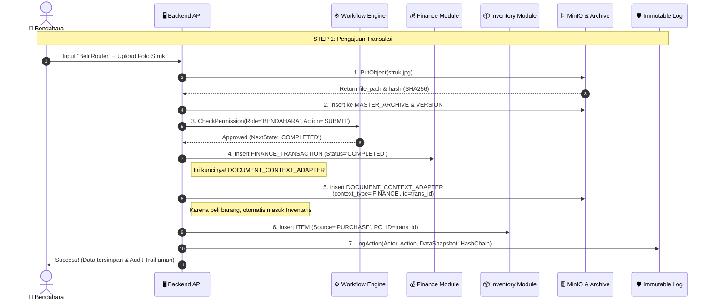

```mermaid
sequenceDiagram
    autonumber
    actor U as 👤 Bendahara
    participant API as 🖥️ Backend API
    participant WF as ⚙️ Workflow Engine
    participant DB_FIN as 💰 Finance Module
    participant DB_INV as 📦 Inventory Module
    participant MINIO as 🗄️ MinIO & Archive
    participant LOG as 🛡️ Immutable Log

    Note over U, LOG: STEP 1: Pengajuan Transaksi
    U->>API: Input "Beli Router" + Upload Foto Struk
    
    %% 1. Upload File dulu
    API->>MINIO: 1. PutObject(struk.jpg)
    MINIO-->>API: Return file_path & hash (SHA256)
    
    %% 2. Buat Record Arsip (MASTER_ARCHIVE)
    API->>MINIO: 2. Insert ke MASTER_ARCHIVE & VERSION
    
    %% 3. Cek Workflow
    API->>WF: 3. CheckPermission(Role='BENDAHARA', Action='SUBMIT')
    WF-->>API: Approved (NextState: 'COMPLETED')
    
    %% 4. Simpan Transaksi Keuangan
    API->>DB_FIN: 4. Insert FINANCE_TRANSACTION (Status='COMPLETED')
    
    %% 5. Link Dokumen ke Transaksi (ADAPTER)
    Note right of API: Ini kuncinya! DOCUMENT_CONTEXT_ADAPTER
    API->>MINIO: 5. Insert DOCUMENT_CONTEXT_ADAPTER<br/>(context_type='FINANCE', id=trans_id)
    
    %% 6. Auto-Create Item Inventaris (Optional)
    Note right of API: Karena beli barang, otomatis masuk Inventaris
    API->>DB_INV: 6. Insert ITEM (Source='PURCHASE', PO_ID=trans_id)
    
    %% 7. The Final Boss: AUDIT LOG
    API->>LOG: 7. LogAction(Actor, Action, DataSnapshot, HashChain)
    
    API-->>U: Success! (Data tersimpan & Audit Trail aman)
```