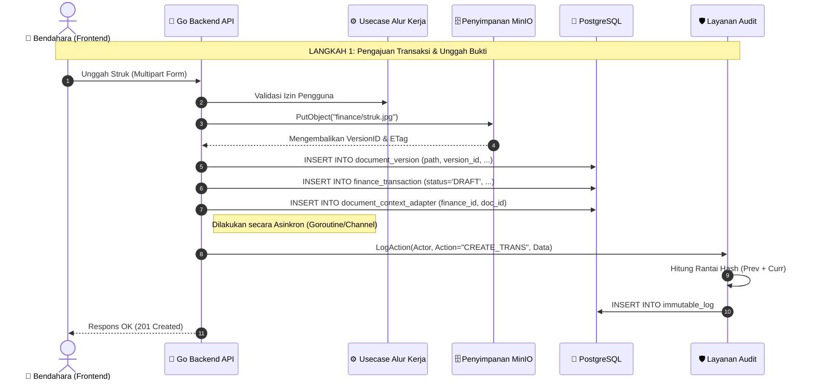

```mermaid
sequenceDiagram
    autonumber
    actor U as 👤 Bendahara (Frontend)
    participant API as 🐹 Go Backend API
    participant WF as ⚙️ Usecase Alur Kerja
    participant MINIO as 🗄️ Penyimpanan MinIO
    participant DB as 🐘 PostgreSQL
    participant LOG as 🛡️ Layanan Audit

    Note over U, LOG: LANGKAH 1: Pengajuan Transaksi & Unggah Bukti
    
    %% 1. Unggah Berkas
    U->>API: Unggah Struk (Multipart Form)
    API->>WF: Validasi Izin Pengguna
    API->>MINIO: PutObject("finance/struk.jpg")
    MINIO-->>API: Mengembalikan VersionID & ETag
    
    %% 2. Simpan Metadata Dokumen
    API->>DB: INSERT INTO document_version (path, version_id, ...)
    
    %% 3. Buat Transaksi
    API->>DB: INSERT INTO finance_transaction (status='DRAFT', ...)
    
    %% 4. Tautkan Dokumen (Adapter)
    API->>DB: INSERT INTO document_context_adapter (finance_id, doc_id)
    
    %% 5. Pencatatan Audit (Kritikal)
    Note right of API: Dilakukan secara Asinkron (Goroutine/Channel)
    API->>LOG: LogAction(Actor, Action="CREATE_TRANS", Data)
    LOG->>LOG: Hitung Rantai Hash (Prev + Curr)
    LOG->>DB: INSERT INTO immutable_log
    
    API-->>U: Respons OK (201 Created)
```