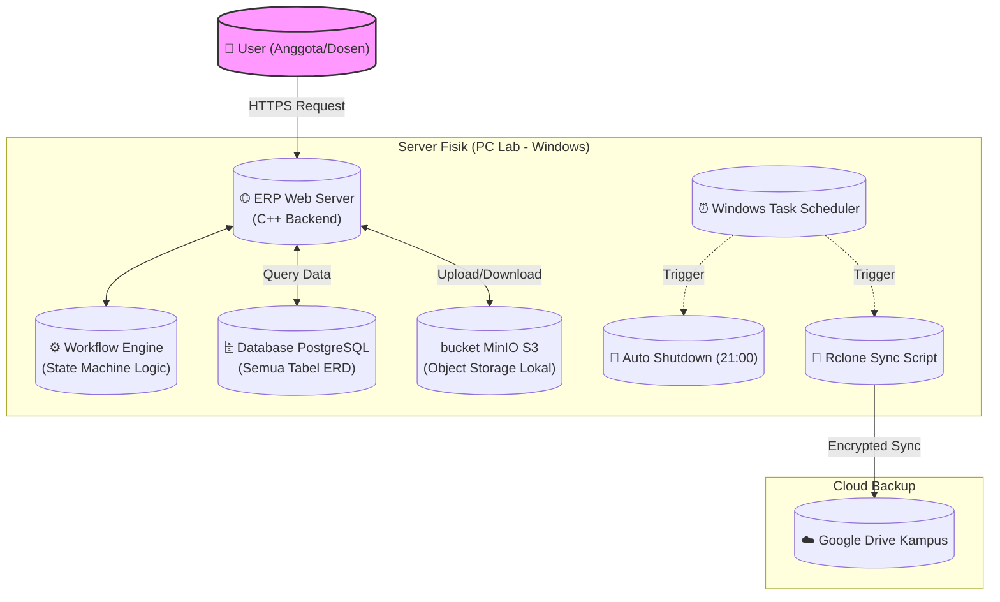

```mermaid
graph TD
    %% User Layer
    User[("👤 User (Anggota/Dosen)")] -->|HTTPS Request| WebServer[("🌐 ERP Web Server<br/>(C++ Backend)")]
    
    %% Server Layer (PC Lab)
    subgraph "Server Fisik (PC Lab - Windows)"
        WebServer
        
        %% Logic
        WorkflowEng[("⚙️ Workflow Engine<br/>(State Machine Logic)")]
        WebServer <--> WorkflowEng
        
        %% Storage Layer
        DB[("🗄️ Database PostgreSQL<br/>(Semua Tabel ERD)")]
        MinIO[("bucket MinIO S3<br/>(Object Storage Lokal)")]
        
        WebServer <-->|Query Data| DB
        WebServer <-->|Upload/Download| MinIO
        
        %% Automation
        TaskSched[("⏰ Windows Task Scheduler")]
        TaskSched -.->|Trigger| AutoShutdown[("🔌 Auto Shutdown (21:00)")]
        TaskSched -.->|Trigger| RcloneScript[("🔄 Rclone Sync Script")]
    end
    
    %% External / Cloud Layer
    subgraph "Cloud Backup"
        GDrive[("☁️ Google Drive Kampus")]
    end
    
    RcloneScript -->|Encrypted Sync| GDrive
    
    %% Style
    classDef server fill:#f9f,stroke:#333,stroke-width:2px;
    class User server
```